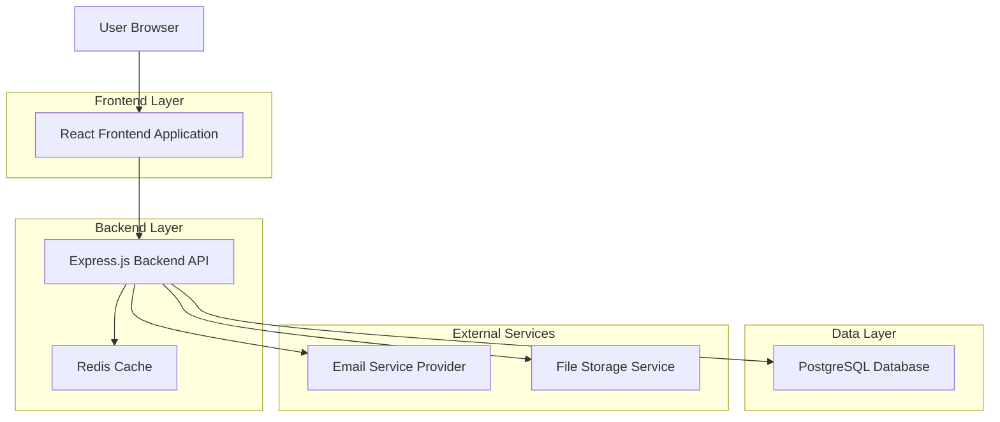
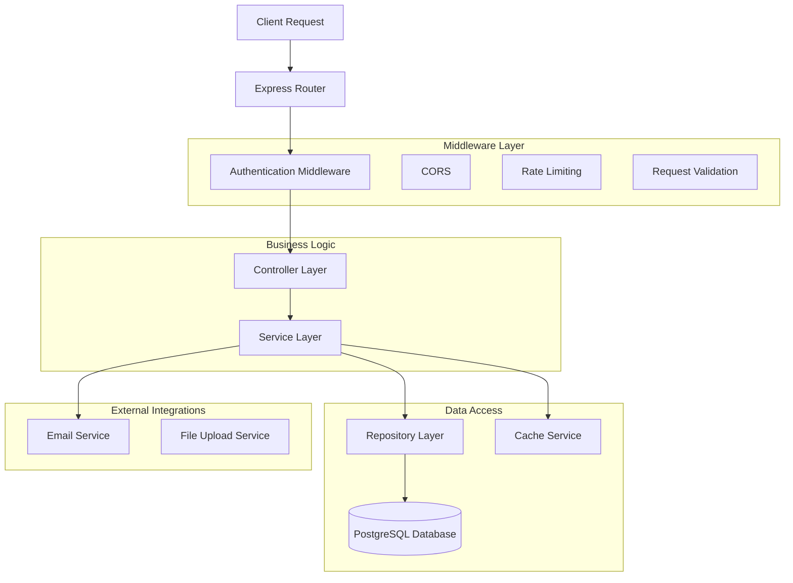
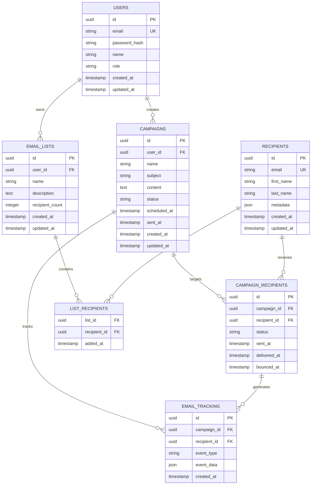

# Email Marketing Application - Technical Architecture Document

## 1. Architecture Design



## 2. Technology Description

* Frontend: React\@18 + Material-UI\@5 + React Router\@6 + Axios + Chart.js

* Backend: Node.js\@18 + Express\@4 + TypeScript + JWT Authentication

* Database: PostgreSQL\@15 with Prisma ORM

* Cache: Redis\@7 for session management and campaign queuing

* Email Service: Integration layer for SMTP/SendGrid/AWS SES

* File Storage: Local storage with S3 compatibility for CSV uploads

## 3. Route Definitions

| Route               | Purpose                                                      |
| ------------------- | ------------------------------------------------------------ |
| /                   | Dashboard page displaying key metrics and campaigns overview |
| /campaigns/new      | Campaign creation wizard with 4-step process                 |
| /campaigns/:id      | Individual campaign details and analytics                    |
| /campaigns/:id/edit | Edit existing campaign (if in draft status)                  |
| /lists              | Email lists management page with import/export functionality |
| /lists/:id          | Individual list details with recipient management            |
| /analytics          | Comprehensive analytics dashboard with charts and reports    |
| /settings           | User settings and account management                         |
| /login              | User authentication page                                     |
| /register           | User registration page                                       |

## 4. API Definitions

### 4.1 Core API

**Authentication**

```
POST /api/auth/login
```

Request:

| Param Name | Param Type | isRequired | Description        |
| ---------- | ---------- | ---------- | ------------------ |
| email      | string     | true       | User email address |
| password   | string     | true       | User password      |

Response:

| Param Name | Param Type | Description              |
| ---------- | ---------- | ------------------------ |
| token      | string     | JWT authentication token |
| user       | object     | User profile information |

**Campaign Management**

```
GET /api/campaigns
POST /api/campaigns
GET /api/campaigns/:id
PUT /api/campaigns/:id
DELETE /api/campaigns/:id
POST /api/campaigns/:id/send
POST /api/campaigns/:id/schedule
```

**Email Lists Management**

```
GET /api/lists
POST /api/lists
GET /api/lists/:id
PUT /api/lists/:id
DELETE /api/lists/:id
POST /api/lists/:id/import
GET /api/lists/:id/export
```

**Analytics and Metrics**

```
GET /api/analytics/dashboard
GET /api/analytics/campaigns/:id
GET /api/analytics/engagement
POST /api/tracking/open/:campaignId/:recipientId
POST /api/tracking/click/:campaignId/:recipientId
```

Example Campaign Creation Request:

```json
{
  "name": "Summer Sale Campaign",
  "subject": "Don't Miss Our Summer Sale - 50% Off!",
  "content": "<html>...</html>",
  "listIds": [1, 2, 3],
  "scheduledAt": "2024-06-15T10:00:00Z"
}
```

## 5. Server Architecture Diagram



## 6. Data Model

### 6.1 Data Model Definition



### 6.2 Data Definition Language

**Users Table**

```sql
CREATE TABLE users (
    id UUID PRIMARY KEY DEFAULT gen_random_uuid(),
    email VARCHAR(255) UNIQUE NOT NULL,
    password_hash VARCHAR(255) NOT NULL,
    name VARCHAR(100) NOT NULL,
    role VARCHAR(20) DEFAULT 'user' CHECK (role IN ('user', 'admin')),
    created_at TIMESTAMP WITH TIME ZONE DEFAULT NOW(),
    updated_at TIMESTAMP WITH TIME ZONE DEFAULT NOW()
);

CREATE INDEX idx_users_email ON users(email);
```

**Campaigns Table**

```sql
CREATE TABLE campaigns (
    id UUID PRIMARY KEY DEFAULT gen_random_uuid(),
    user_id UUID NOT NULL REFERENCES users(id) ON DELETE CASCADE,
    name VARCHAR(255) NOT NULL,
    subject VARCHAR(255) NOT NULL,
    content TEXT NOT NULL,
    status VARCHAR(20) DEFAULT 'draft' CHECK (status IN ('draft', 'scheduled', 'sending', 'sent', 'cancelled')),
    scheduled_at TIMESTAMP WITH TIME ZONE,
    sent_at TIMESTAMP WITH TIME ZONE,
    created_at TIMESTAMP WITH TIME ZONE DEFAULT NOW(),
    updated_at TIMESTAMP WITH TIME ZONE DEFAULT NOW()
);

CREATE INDEX idx_campaigns_user_id ON campaigns(user_id);
CREATE INDEX idx_campaigns_status ON campaigns(status);
CREATE INDEX idx_campaigns_scheduled_at ON campaigns(scheduled_at);
```

**Email Lists Table**

```sql
CREATE TABLE email_lists (
    id UUID PRIMARY KEY DEFAULT gen_random_uuid(),
    user_id UUID NOT NULL REFERENCES users(id) ON DELETE CASCADE,
    name VARCHAR(255) NOT NULL,
    description TEXT,
    recipient_count INTEGER DEFAULT 0,
    created_at TIMESTAMP WITH TIME ZONE DEFAULT NOW(),
    updated_at TIMESTAMP WITH TIME ZONE DEFAULT NOW()
);

CREATE INDEX idx_email_lists_user_id ON email_lists(user_id);
```

**Recipients Table**

```sql
CREATE TABLE recipients (
    id UUID PRIMARY KEY DEFAULT gen_random_uuid(),
    email VARCHAR(255) UNIQUE NOT NULL,
    first_name VARCHAR(100),
    last_name VARCHAR(100),
    metadata JSONB,
    created_at TIMESTAMP WITH TIME ZONE DEFAULT NOW(),
    updated_at TIMESTAMP WITH TIME ZONE DEFAULT NOW()
);

CREATE INDEX idx_recipients_email ON recipients(email);
```

**List Recipients Junction Table**

```sql
CREATE TABLE list_recipients (
    list_id UUID NOT NULL REFERENCES email_lists(id) ON DELETE CASCADE,
    recipient_id UUID NOT NULL REFERENCES recipients(id) ON DELETE CASCADE,
    added_at TIMESTAMP WITH TIME ZONE DEFAULT NOW(),
    PRIMARY KEY (list_id, recipient_id)
);
```

**Campaign Recipients Table**

```sql
CREATE TABLE campaign_recipients (
    id UUID PRIMARY KEY DEFAULT gen_random_uuid(),
    campaign_id UUID NOT NULL REFERENCES campaigns(id) ON DELETE CASCADE,
    recipient_id UUID NOT NULL REFERENCES recipients(id) ON DELETE CASCADE,
    status VARCHAR(20) DEFAULT 'pending' CHECK (status IN ('pending', 'sent', 'delivered', 'bounced', 'failed')),
    sent_at TIMESTAMP WITH TIME ZONE,
    delivered_at TIMESTAMP WITH TIME ZONE,
    bounced_at TIMESTAMP WITH TIME ZONE,
    UNIQUE(campaign_id, recipient_id)
);

CREATE INDEX idx_campaign_recipients_campaign_id ON campaign_recipients(campaign_id);
CREATE INDEX idx_campaign_recipients_status ON campaign_recipients(status);
```

**Email Tracking Table**

```sql
CREATE TABLE email_tracking (
    id UUID PRIMARY KEY DEFAULT gen_random_uuid(),
    campaign_id UUID NOT NULL REFERENCES campaigns(id) ON DELETE CASCADE,
    recipient_id UUID NOT NULL REFERENCES recipients(id) ON DELETE CASCADE,
    event_type VARCHAR(20) NOT NULL CHECK (event_type IN ('open', 'click', 'unsubscribe')),
    event_data JSONB,
    created_at TIMESTAMP WITH TIME ZONE DEFAULT NOW()
);

CREATE INDEX idx_email_tracking_campaign_id ON email_tracking(campaign_id);
CREATE INDEX idx_email_tracking_event_type ON email_tracking(event_type);
CREATE INDEX idx_email_tracking_created_at ON email_tracking(created_at DESC);
```

**Initial Data**

```sql
-- Insert default admin user
INSERT INTO users (email, password_hash, name, role) VALUES 
('admin@example.com', '$2b$10$example_hash', 'Admin User', 'admin');

-- Insert sample email templates (if templates table exists)
-- This would be extended based on template requirements
```

