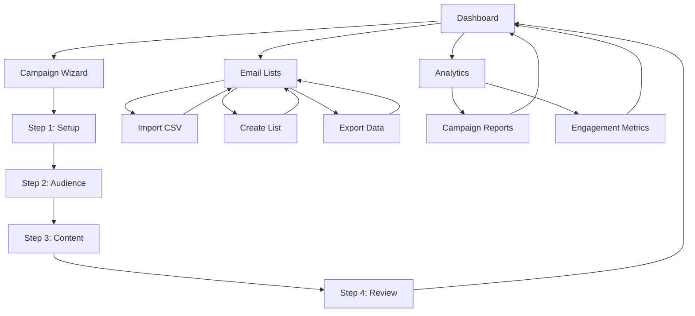

# Email Marketing Application - Product Requirements Document

## 1. Product Overview

A comprehensive full-stack email marketing application that enables users to create, manage, and track email campaigns with detailed analytics and recipient management.

The platform solves the challenge of managing email marketing campaigns by providing an intuitive dashboard, campaign creation wizard, and comprehensive tracking capabilities. Target users include marketing teams, small businesses, and organizations needing professional email marketing tools.

The product aims to capture the growing email marketing automation market with a focus on user experience and extensibility for future communication channels.

## 2. Core Features

### 2.1 User Roles

| Role | Registration Method | Core Permissions |
|------|---------------------|------------------|
| Marketing User | Email registration with verification | Can create campaigns, manage lists, view analytics |
| Admin User | Invitation-based registration | Full access including user management and system settings |

### 2.2 Feature Module

Our email marketing application consists of the following main pages:

1. **Dashboard**: Key metrics display, campaigns overview table, quick action menus
2. **Campaign Creation Wizard**: 4-step guided campaign setup, audience selection, content creation, scheduling
3. **Email Lists Management**: List creation, CSV import/export, recipient management
4. **Campaign Analytics**: Detailed metrics tracking, engagement reports, delivery status

### 2.3 Page Details

| Page Name | Module Name | Feature description |
|-----------|-------------|---------------------|
| Dashboard | Key Metrics Cards | Display total campaigns, recipients, average open rate, click-through rate with real-time updates |
| Dashboard | Campaigns Table | List all campaigns with columns for name, status, recipients, open rate, click rate, and kebab menu actions |
| Dashboard | Quick Actions Menu | Provide view report, duplicate campaign, delete campaign options for each table row |
| Campaign Wizard | Campaign Setup | Capture campaign name and email subject line with validation |
| Campaign Wizard | Audience Selection | Display email lists with checkboxes, show dynamic recipient count based on selections |
| Campaign Wizard | Content Creation | Template selection, rich-text editor, preview modal (desktop/mobile), test email functionality |
| Campaign Wizard | Review & Schedule | Campaign summary display, send now option, schedule for later with date/time picker |
| Email Lists | Lists Table | Display list name, recipient count, creation date with sorting and filtering |
| Email Lists | Import/Export | CSV upload functionality, export selected lists, bulk operations |
| Email Lists | List Management | Create new lists, edit list names, delete lists, view recipient details |
| Analytics | Campaign Metrics | Track sent, delivered, bounced status with detailed breakdowns |
| Analytics | Engagement Tracking | Monitor unique opens, clicks, unsubscribes with trend analysis |
| Analytics | Status Management | Handle draft, scheduled, sending, sent campaign states with progress indicators |

## 3. Core Process

**Main User Flow:**
Users log in to access the dashboard where they view campaign performance metrics. To create a new campaign, they navigate through a 4-step wizard: setting up campaign details, selecting target audiences from email lists, creating content using templates and rich editor, then reviewing and scheduling. Email lists are managed separately where users can import CSV files, create custom lists, and export data. All campaign activities are tracked with detailed analytics showing delivery status and engagement metrics.

**Campaign Creation Flow:**
Start campaign → Enter name and subject → Select email lists → Choose template → Edit content → Preview email → Send test → Review summary → Schedule or send immediately → Monitor progress

**List Management Flow:**
Access lists → Create new list or import CSV → Add/edit recipients → Export data → Manage list settings → Delete if needed

## 4. User Interface Design

### 4.1 Design Style

- **Primary Colors**: Blue (#1976d2) for primary actions, Green (#4caf50) for success states
- **Secondary Colors**: Grey (#757575) for secondary text, Red (#f44336) for warnings/errors
- **Button Style**: Material Design rounded buttons with subtle shadows and hover effects
- **Font**: Roboto font family with 14px base size, 16px for headings, 12px for captions
- **Layout Style**: Card-based design with clean spacing, top navigation with sidebar for main sections
- **Icons**: Material Design icons for consistency, email and analytics themed icons

### 4.2 Page Design Overview

| Page Name | Module Name | UI Elements |
|-----------|-------------|-------------|
| Dashboard | Key Metrics Cards | 4 prominent cards with large numbers, icons, and percentage changes in a responsive grid |
| Dashboard | Campaigns Table | Material-UI DataGrid with sorting, filtering, pagination, and action menus |
| Campaign Wizard | Step Navigation | Horizontal stepper component showing progress through 4 steps with validation indicators |
| Campaign Wizard | Content Editor | Rich-text editor with toolbar, template gallery, and split-screen preview |
| Email Lists | Lists Table | Sortable table with search functionality, bulk selection, and action buttons |
| Email Lists | Import Modal | Drag-and-drop CSV upload area with progress indicator and validation feedback |
| Analytics | Charts | Interactive charts using Chart.js for metrics visualization with date range selectors |
| Analytics | Status Indicators | Color-coded status badges and progress bars for campaign states |

### 4.3 Responsiveness

The application is desktop-first with mobile-adaptive design. All components use Material-UI's responsive breakpoints (xs, sm, md, lg, xl). Touch interactions are optimized for mobile devices with larger tap targets and swipe gestures for table navigation. The campaign wizard adapts to single-column layout on mobile with collapsible sections for better usability.